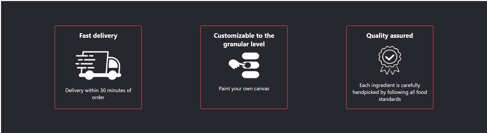
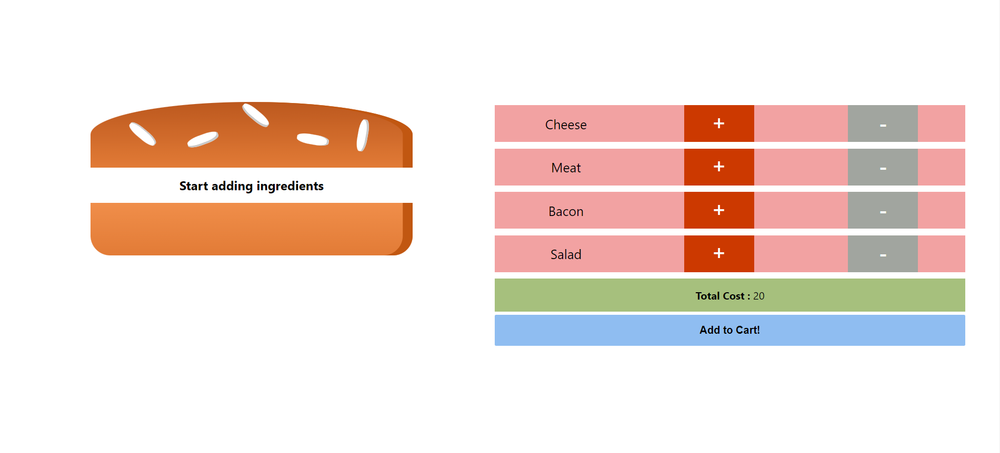
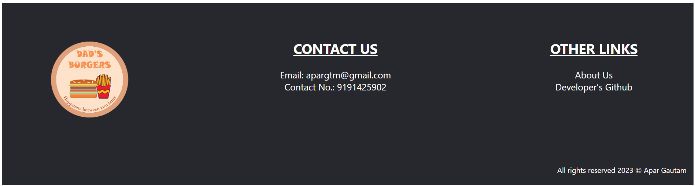
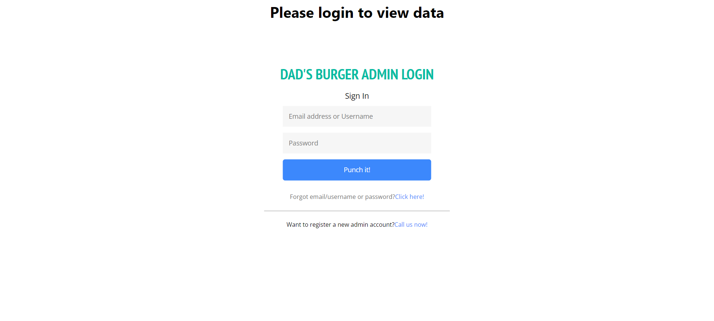
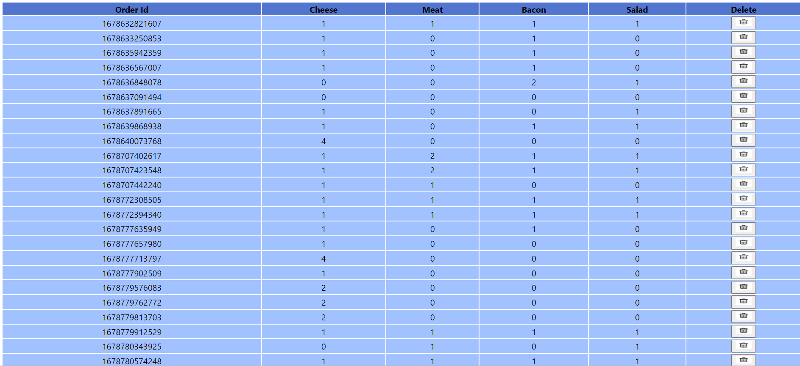

<h1 align="center">Burger-builder</h1>
<h2 align="center">Make your own Burger</h2>

# Screenshots💻📱

# 🎯 About

This app was developed for practicing react js. It allows you to make your own burger by interactively adding the ingredients and order it. 
The homepage of the app displays a burger and controls for you to add ingredients to the burger. 
You can find the total amount for your burger in the same page. 
After you purchase, a modal is shown which shows your order summary. Then, you can order the burger. If the backend logic is available along with a database, your order is sent to the database. 
If the backend logic is absent or an error occured in the backend, the error is caught and displayed in a modal. 
Also, the app is mobile friendly, a side bar appears for mobile devices insead of the navigation bar. 

#  ▶️ Demo
You can find the demo project(only front end included) here:
- [GitHub] (https://aparg.github.io/burger-builder-frontend)

A live demo with backend logic included is now available for this app hosted using vercel. You can check it out here:
- https://burger-builder-qnpv.vercel.app/ (app)
- https://burger-builder-aparg.vercel.app/display (display api)

#  🧔 Author
- Apar Gautam(https://apargautam.com.np)
